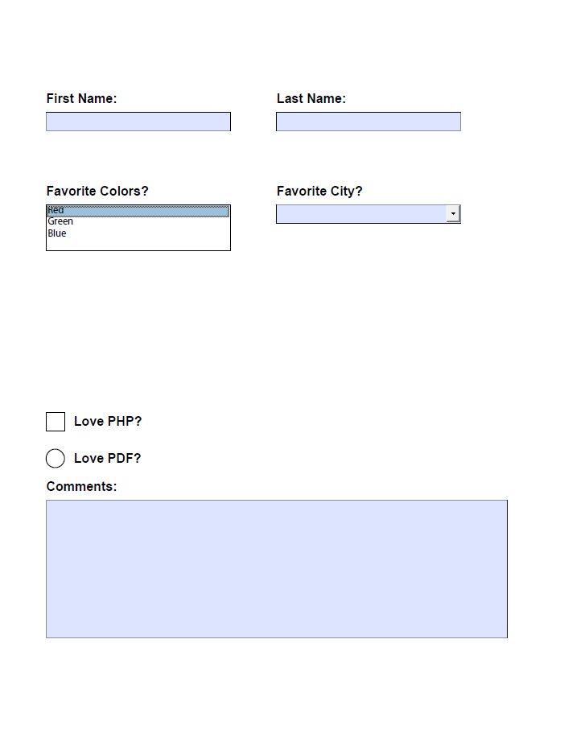

pop-pdf
=======

[](https://github.com/popphp/pop-pdf/actions)
[](http://cc.popphp.org/pop-pdf/)

[](https://discord.gg/TZjgT74U7E)

* [Overview](#overview)
* [Install](#install)
* [Quickstart](#quickstart)
* [PDF](#pdf)
    - [Write to File](#write-to-file)
    - [Output to HTTP](#output-to-http)
    - [Import from File](#import-from-file)
    - [Import from Raw Data](#import-from-raw-data)
    - [Import from Images](#import-from-images)
    - [Extract Text](#extract-text)
* [Documents](#documents)
    - [Compression](#compression)
    - [Page Origin](#page-origin)
* [Pages](#pages)
* [Fonts](#fonts)
    - [Standard](#standard)
    - [Embedded](#embedded)
* [Text](#text)
    - [Alignment](#alignment)
    - [String Width](#string-width)
* [Styles](#styles)
* [Images](#images)
    - [Image Size](#image-size)
* [Paths](#paths)
* [Annotations](#annotations)
    - [URLs](#urls)
    - [Internal](#internal)
* [Forms](#forms)
* [HTML](#html)

Overview
--------
Pop PDF is a robust PDF processing component that's simple to use. With it, you can create
PDF documents from scratch, or import existing ones and add to or modify them. It supports
embedding images, fonts and URLs, as well as a set of drawing, effect and type features.

`pop-pdf` is a component of the [Pop PHP Framework](https://www.popphp.org/).

[Top](#pop-pdf)

Install
-------

Install `pop-pdf` using Composer.

    composer require popphp/pop-pdf

Or, require it in your composer.json file

    "require": {
        "popphp/pop-pdf" : "^5.2.0"
    }

[Top](#pop-pdf)

Quickstart
----------

### Create a simple PDF

Create a simple 1-page PDF document with the text "Hello World" on the page.
The page size will be letter. The text string will be positioned (50, 50)
from the top left and use the standard Arial font.

```php
use Pop\Pdf\Pdf;
use Pop\Pdf\Document;
use Pop\Pdf\Document\Font;
use Pop\Pdf\Document\Page;
use Pop\Pdf\Document\Page\Text;

$document = new Document();
$document->addFont(Font::ARIAL);

$page = $document->createPage(Page::LETTER);
$page->addText(new Text('Hello World', 12), Font::ARIAL, 50, 742);

Pdf::writeToFile($document, 'my-document.pdf');
```

### Embed an image

Using the same example from above, let's add an image to it:

```php
use Pop\Pdf\Pdf;
use Pop\Pdf\Document;
use Pop\Pdf\Document\Font;
use Pop\Pdf\Document\Page;
use Pop\Pdf\Document\Page\Text;
use Pop\Pdf\Document\Page\Image;

$document = new Document();
$document->addFont(Font::ARIAL);

$page = $document->createPage(Page::LETTER);
$page->addText(new Text('Look at this image:', 12), Font::ARIAL, 50, 742);
$page->addImage(Image::createImageFromFile('my-image.jpg'), 50, 380);

Pdf::writeToFile($document, 'my-document.pdf');
```

[Top](#pop-pdf)

PDF
---

The PDF format specification is a vast and comprehensive format that has been around for a
long time. It is comprised of other various media specifications such as fonts and images.
The `pop-pdf` attempts to present all of these various components in an intuitive, object-oriented
way so that a developer can assemble, build and compile valid PDF documents programmatically.

The main `Pop\Pdf\Pdf` class serves as a simple processing class with a set of static methods
to route the various object components to the right place to be processed.

- `writeToFile($document, $filename = 'pop.pdf'): void`
- `outputToHttp($document, $filename = 'pop.pdf', $forceDownload = false, $headers = []): void`
- `importFromFile($file, $pages = null): AbstractDocument`
- `importRawData($data, $pages = null): AbstractDocument`
- `importFromImages($images, $quality = 70): AbstractDocument`

### Write to File

Once a PDF document has been assembled, you can pass it to the `writeToFile()` method to
compile the PDF and save it to a file on disk:

```php
use Pop\Pdf\Pdf;

// Pass a valid document object and a path/filename
Pdf::writeToFile($document, 'path/to/my-document.pdf');
```

### Output to HTTP

Alternatively, you can push the PDF document out to an HTTP client. Giving it a filename
sets the `Content-Disposition` filename value. Setting `$forceDownload` to true sets
the `Content-Disposition` value to "attachment" to force a download (vs display inline.)
A fourth `$headers` parameter is available to output any additional HTTP headers. 

```php
use Pop\Pdf\Pdf;

// Pass a valid document object and a path/filename
Pdf::outputToHttp($document, 'my-document.pdf', true);
```

### Import from File

You can take an existing PDF and import it to add new content to it. It will translate
the PDF document's content into the appropriate objects such as pages, fonts, images
and text. From there, you can add more content to the PDF document object and save it.

```php
use Pop\Pdf\Pdf;

$doc = Pdf::importFromFile('path/to/document.pdf');
```

You can also choose which pages of a PDF document to import:

```php
use Pop\Pdf\Pdf;

// Import pages 2, 4 and 6 from the PDF document
$doc = Pdf::importFromFile('path/to/document.pdf', [2, 4, 6]);
```

### Import from Raw Data

If you have a stream of raw data from a PDF file, you can import that as well.
This method supports optional page selection as well

```php
use Pop\Pdf\Pdf;

$doc = Pdf::importRawData($rawData, [2, 4, 6]);
```

### Import from Images

If you have an array of images, you can convert them into a PDF document object
where each image becomes a page in the PDF document.

```php
use Pop\Pdf\Pdf;

$doc = Pdf::importFromImages($arrayOfImages);
```

### Extract Text

If you just want to extract the text from a PDF that contains text (not a PDF comprised of images with text in them),
you can do so like this:

```php
use Pop\Pdf\Pdf;

$text = Pdf::extractTextFromFile('path/to/document.pdf');
```

```php
use Pop\Pdf\Pdf;

$text = Pdf::extractTextFromData($pdfStream);
```

[Top](#pop-pdf)

Documents
---------

The document object serves as the main collection object of all of the components that go into
building and compiling a PDF document. This includes pages, fonts and forms.

### Compression

A PDF document can be compressed if needed to attempt to reduce file size.

```php
use Pop\Pdf\Document;

$document = new Document();
$document->setCompression(true);
```

### Page Origin

A potentially confusing aspect of PDF documents is that the default page origin is the bottom left.
This means that all coordinates and any math based on the coordinates has to be calculated from the
bottom left.

If you'd prefer to calculate the origin from a different place, you can set that with the `setOrigin()`
method on the document object. This will automatically translate your preferred origin to the native
PDF origin.

Options for setting the origin of the document are:

* `ORIGIN_TOP_LEFT`
* `ORIGIN_TOP_RIGHT`
* `ORIGIN_BOTTOM_LEFT`
* `ORIGIN_BOTTOM_RIGHT`
* `ORIGIN_CENTER`

```php
use Pop\Pdf\Document;

$document = new Document();
$document->setOrigin(Document::ORIGIN_TOP_LEFT);
```

[Top](#pop-pdf)

Pages
-----

Pages can be virtually any size, but there are a number of pre-defined sizes available
as constants in the `Pop\Pdf\Document\Page` class:

| Page          | (W x H)       | Page  | (W x H)       | Page  | (W x H)       |
|---------------|---------------|-------|---------------|-------|---------------|
| `ENVELOPE_10` | (297  x 684)  | `A1`  | (1684 x 2384) | `B1`  | (2064 x 2920) |
| `ENVELOPE_C5` | (461  x 648)  | `A2`  | (1191 x 1684) | `B2`  | (1460 x 2064) |
| `ENVELOPE_DL` | (312  x 624)  | `A3`  | (842  x 1191) | `B3`  | (1032 x 1460) |
| `FOLIO`       | (595  x 935)  | `A4`  | (595  x 842)  | `B4`  | (729  x 1032) |
| `EXECUTIVE`   | (522  x 756)  | `A5`  | (420  x 595)  | `B5`  | (516  x 729)  |
| `LETTER`      | (612  x 792)  | `A6`  | (297  x 420)  | `B6`  | (363  x 516)  |
| `LEGAL`       | (612  x 1008) | `A7`  | (210  x 297)  | `B7`  | (258  x 363)  |
| `LEDGER`      | (1224 x 792)  | `A8`  | (148  x 210)  | `B8`  | (181  x 258)  |
| `TABLOID`     | (792  x 1224) | `A9`  | (105  x 148)  | `B9`  | (127  x 181)  |
| `A0`          | (2384 x 3370) | `B0`  | (2920 x 4127) | `B10` | (91   x 127)  |

```php
use Pop\Pdf\Document;
use Pop\Pdf\Document\Page;

$pageLetter = new Page(Page::LETTER);
$pageCustom = new Page(500, 1000); // Custom width and height

$document = new Document();
$document->addPages([$pageLetter, $pageCustom]);
```

Alternatively, you can use the document object as a page factory, which will create a page
object, automatically add the page to the document object and return the new page:

```php
use Pop\Pdf\Document;
use Pop\Pdf\Document\Page;

$document  = new Document();
$pageLegal = $document->createPage(Page::LEGAL);
```

There are a number of other methods within the document object to assist with managing
various components:

- `addPage(Page $page): Document`
- `addPages(array $pages): Document`
- `createPage(mixed $size, ?int $height = null): Page`
- `copyPage(int $p, bool $preserveContent = true): Page`
- `orderPages(array $pages): Document`
- `deletePage(int $p): Document`
- `addFont(Font|string $font, bool $embedOverride = false): Document`
- `embedFont(Font $font, bool $embedOverride = false): Document`
- `setCurrentPage(int $p): Document`
- `setCurrentFont(string $name): Document`

[Top](#pop-pdf)

Fonts
-----

Fonts are required to be added to a document for any text that might be added to any page.
The font that a text object uses will be defined when adding the text to a page object, but
that font will need to be present in the document object. Once fonts are added to a document,
they can be used repeatedly by any text objects on any pages of the document.

There are two types of supported fonts: **standard** and **embedded**.

[Top](#pop-pdf)

### Standard

Part of the PDF specification is that a total of 25 standard fonts that are supported
by PDF and PDF readers. This means that no additional font files have to be embedded and
the fonts are available by default.

|                 | Standard PDF Fonts  |                        |
|-----------------|---------------------|------------------------|
|Arial            |CourierNew,Bold      |Times-Bold              |
|Arial,Italic     |Courier-BoldOblique  |Times-Italic            |
|Arial,Bold       |CourierNew,BoldItalic|Times-BoldItalic        |
|Arial,BoldItalic |Helvetica            |TimesNewRoman           |
|Courier          |Helvetica-Oblique    |TimesNewRoman,Italic    |
|CourierNew       |Helvetica-Bold       |TimesNewRoman,Bold      |
|Courier-Oblique  |Helvetica-BoldOblique|TimesNewRoman,BoldItalic|
|CourierNew,Italic|Symbol               |ZapfDingbats            |
|Courier-Bold     |Times-Roman          |                        |

References to each of these standard fonts are available as constants on the main
font class, `Pop\Pdf\Document\Font`:

- `Font::ARIAL`
- `Font::ARIAL_ITALIC`
- `Font::ARIAL_BOLD`
- `Font::ARIAL_BOLD_ITALIC`
- `Font::COURIER`
- `Font::COURIER_OBLIQUE`
- `Font::COURIER_BOLD`
- `Font::COURIER_BOLD_OBLIQUE`
- `Font::COURIER_NEW`
- `Font::COURIER_NEW_ITALIC`
- `Font::COURIER_NEW_BOLD`
- `Font::COURIER_NEW_BOLD_ITALIC`
- `Font::HELVETICA`
- `Font::HELVETICA_OBLIQUE`
- `Font::HELVETICA_BOLD`
- `Font::HELVETICA_BOLD_OBLIQUE`
- `Font::SYMBOL`
- `Font::TIMES_ROMAN`
- `Font::TIMES_BOLD`
- `Font::TIMES_ITALIC`
- `Font::TIMES_BOLD_ITALIC`
- `Font::TIMES_NEW_ROMAN`
- `Font::TIMES_NEW_ROMAN_ITALIC`
- `Font::TIMES_NEW_ROMAN_BOLD`
- `Font::TIMES_NEW_ROMAN_BOLDITALIC`
- `Font::ZAPF_DINGBATS`

```php
use Pop\Pdf\Pdf;
use Pop\Pdf\Document;
use Pop\Pdf\Document\Font;
use Pop\Pdf\Document\Page;
use Pop\Pdf\Document\Page\Text;

$document = new Document();
$document->addFont(Font::HELVETICA_BOLD);

$page = $document->createPage(Page::LETTER);
$page->addText(new Text('Hello World', 12), Font::HELVETICA_BOLD, 50, 742);

Pdf::writeToFile($document, 'my-document.pdf');
```

[Top](#pop-pdf)

### Embedded

If you require a font outside of the set of standard fonts, the PDF specification
supports embedding a number of different external font formats:

* TrueType (ttf)
* OpenType (otf)
* Type1 (pfb)

Most fonts of these types should work, but there are situations were the font may not
be parsable, such as when a font's embeddable flag is set to false.

```php
use Pop\Pdf\Pdf;
use Pop\Pdf\Document;
use Pop\Pdf\Document\Font;
use Pop\Pdf\Document\Page;

$font     = new Font('/path/to/some/font.ttf');
$document = new Document();
$document->embedFont($font);

$page = new Page(Page::LETTER);
$page->addText(new Page\Text('Hello World', 36), $font->getName(), 50, 600);

$document->addPage($page);

Pdf::writeToFile($document, 'my-document.pdf');
```

[Top](#pop-pdf)

Text
----

Once font objects have been added to a document object, text objects can then be added
to page objects, while referencing the available font objects in the document.

The constructor of the text object takes the string and the size:

```php
use Pop\Pdf\Document\Page\Text;

$text = new Text('Hello World', 12);
```

There are a number of methods to assist in modifying the text object:

- `setSize(int|float $size): Text`
- `setFillColor(ColorInterface $color): Text`
- `setStrokeColor(ColorInterface $color): Text`
- `setStroke(int $width, ?int $dashLength = null, ?int $dashGap = null): Text`
- `setRotation(int $rotation): Text`
- `setCharWrap(int $charWrap, ?int $leading = null): Text`
- `setLeading(int $leading): Text`

A basic character wrap can be set with the `setCharWrap()` method. The leading of the
wrapped text can be either set with the second parameter or by the `setLeading()` method.

```php
use Pop\Pdf\Pdf;
use Pop\Pdf\Document;
use Pop\Pdf\Document\Font;
use Pop\Pdf\Document\Page;
use Pop\Pdf\Document\Page\Text;

$document = new Document();
$document->addFont(Font::ARIAL);

$longString = 'Lorem ipsum [...really long string...] anim id est laborum.';
$text = new Text($longString, 12);
$text->setCharWrap(80, 16); // Set the wrap at 80 characters and a leading of 16

$page = $document->createPage(Page::LETTER);
$page->addText($text, Font::ARIAL, 50, 742);

Pdf::writeToFile($document, 'my-document.pdf');
```

[Top](#pop-pdf)

Styles
------

Style objects can be added to the document to provide easier management of text and font styles used in multiple
places across the PDF document and its pages.

```php
use Pop\Pdf\Document;
use Pop\Pdf\Document\Font;

$document = new Document();
$document->addFont(Font::ARIAL);
$document->createStyle('normal', Font::ARIAL, 12);

$page = $document->createPage(Page::LETTER);
$page->addText($text, 'normal', 50, 742); // The second parameter can either be a font or a reference to a style
```

So any text added to any page referencing the same style can easily be changed across the entire document by only
changing the style object.

[Top](#pop-pdf)

### Alignment

Alignment objects are objects that assist with handling more advanced alignment
and wrapping of text based on geometric positioning. When creating an alignment
object, you define a bounding areas to which the text will be confined.

**Left-aligned box**

```php
use Pop\Pdf\Pdf;
use Pop\Pdf\Document;
use Pop\Pdf\Document\Font;
use Pop\Pdf\Document\Page;
use Pop\Pdf\Document\Page\Text;

$document = new Document();
$document->addFont(Font::ARIAL);

$longString = 'Lorem ipsum [...really long string...] anim id est laborum.';
$text = new Text($longString, 12);

// Create a left-aligned bounding area with the
// X between 50 and 350; leading set 16
$text->setAlignment(Alignment::createLeft(50, 350, 16));

$page = $document->createPage(Page::LETTER);
$page->addText($text, Font::ARIAL, 50, 742);

Pdf::writeToFile($document, 'my-document.pdf');
```

**Right-aligned box**

```php
// Create a right-aligned bounding area with the
// X between 250 and 550; leading set 16
$text->setAlignment(Alignment::createRight(250, 550, 16));
```

**Center-aligned box**

```php
// Create a center-aligned bounding area with the
// X between 50 and 350; leading set 16
$text->setAlignment(Alignment::createCenter(200, 412, 16));
```

[Top](#pop-pdf)

### String Width

An important and useful tool with working with text and fonts to the ability
to calculate the width of a string of characters rendered in a particular font.
This is very helpful when attempting to correctly position text on the page.

There is a method on the font object that will allow you pass a string of text
to it, as well as the desired size, to give you the approximate width those characters
will take up rendered in that font at that size.

This works for both standard and embedded fonts.

```php
use Pop\Pdf\Document\Font;

$font  = new Font(Font::HELVETICA_BOLD);
$width = $font->getStringWidth('Hello World', 12);
var_dump($width);
```

This will give us the approximate width in points of the string `Hello World` in
12pt Helvetica Bold:

```text
float(66.672)
```

[Top](#pop-pdf)

Images
------

Images can be easily added to page objects. However, in a PDF document, the origin of an
image is the bottom of the image. You will have to consider how the image's height affects
the placement of the image on the page in relation to the page origin.

In this example below, the image is 320 x 320. If you place the `$y` value at 742
(top origin 792 - 50), then only the bottom 50 pixels of the image would display
at the top of the page, while the remainder bleeds off the top page border. Therefore,
the height should be taken into account and the `$y` value should be a value like 422
(top origin 792 - 50 - 320). This would make the image appear with the top of it starting
at 50 pixels from the top of the page, and you would be able to safely see the entire
image on the page.

```php
use Pop\Pdf\Pdf;
use Pop\Pdf\Document;
use Pop\Pdf\Document\Page;
use Pop\Pdf\Document\Page\Image;

$document = new Document();
$page     = $document->createPage(Page::LETTER);
$page->addImage(Image::createImageFromFile('my-image.jpg'), 50, 422);

Pdf::writeToFile($document, 'my-document.pdf');
```

In the above example, the image is pulled from a file. You can also import an image from a
raw stream:

```php
$page->addImage(Image::loadImageFromStream($imageContents), 50, 422);
```

[Top](#pop-pdf)

### Image Size

You can resize a larger image when adding it to a page. 

```php
use Pop\Pdf\Pdf;
use Pop\Pdf\Document;
use Pop\Pdf\Document\Page;
use Pop\Pdf\Document\Page\Image;

$image = Image::createImageFromFile('my-image.jpg');
$image->resizeToWidth(120);

$document = new Document();
$page     = $document->createPage(Page::LETTER);
$page->addImage($image, 50, 622);

Pdf::writeToFile($document, 'my-document.pdf');
```

The following methods are available to resize an image:

- `resizeToWidth(int $width, bool $preserveResolution = false): Image`
- `resizeToHeight(int $height, bool $preserveResolution = false): Image`
- `resize(int $pixel, bool $preserveResolution = false): Image`
- `scale(float $scale, bool $preserveResolution = false): Image`

The `$preserveResolution` flag is set to `false` by default. This will
resize the image resource, which will reduce it in not only dimensional size,
but also reduce its data size as well.

If you wish to keep the image in its original higher quality, and
only reduce the dimensions, you can set the `$preserveResolution` flag
to `true`. This is typically a good method to keep the image clean and crisp
when being reduced to a smaller dimension.

[Top](#pop-pdf)

Paths
-----

You can add path objects to a page to draw vector lines and shapes on the page object.

```php
use Pop\Pdf\Pdf;
use Pop\Pdf\Document;
use Pop\Pdf\Document\Page;
use Pop\Pdf\Document\Page\Path;
use Pop\Color\Color;

$document = new Document();

$path = new Path(Path::FILL_STROKE);
$path->setFillColor(Color::rgb(155, 20, 20))
    ->setStrokeColor(Color::rgb(81, 125, 153))
    ->setStroke(5)
    ->drawRectangle(50, 400, 320, 240);

$page = new Page(Page::LETTER);
$page->addPath($path);

$document->addPage($page);

Pdf::writeToFile($document, 'my-document.pdf');
```

The methods to control color and style include:

- `setFillColor(Color\ColorInterface $color): Path`
- `setStrokeColor(Color\ColorInterface $color): Path`
- `setStroke(int $width, ?int $dashLength = null, ?int $dashGap = null): Path`
- `setStyle(string $style): Path`

The `setStyle()` method can take one of the available style constants as its parameter:

- `Path::STROKE`
- `Path::STROKE_CLOSE`
- `Path::FILL`
- `Path::FILL_EVEN_ODD`
- `Path::FILL_STROKE`
- `Path::FILL_STROKE_EVEN_ODD`
- `Path::FILL_STROKE_CLOSE`
- `Path::FILL_STROKE_CLOSE_EVEN_ODD`
- `Path::CLIPPING`
- `Path::CLIPPING_FILL`
- `Path::CLIPPING_NO_STYLE`
- `Path::CLIPPING_EVEN_ODD`
- `Path::CLIPPING_EVEN_ODD_FILL`
- `Path::CLIPPING_EVEN_ODD_NO_STYLE`
- `Path::NO_STYLE`

The basic methods available to draw paths and shapes are:

- `drawLine(int $x1, int $y1, int $x2, int $y2): Path`
- `drawRectangle(int $x, int $y, int $w, ?int $h = null): Path`
- `drawRoundedRectangle(int $x, int $y, int $w, ?int $h = null, int $rx = 10, ?int $ry = null): Path`
- `drawSquare(int $x, int $y, int $w): Path`
- `drawRoundedSquare(int $x, int $y, int $w, int $rx = 10, ?int $ry = null): Path`
- `drawPolygon(array $points): Path`
- `drawEllipse(int $x, int $y, int $w, ?int $h = null): Path`
- `drawCircle(int $x, int $y, int $w): Path`
- `drawArc(int $x, int $y, int $start, int $end, int $w, ?int $h = null): Path`
- `drawChord(int $x, int $y, int $start, int $end, int $w, ?int $h = null): Path`
- `drawPie(int $x, int $y, int $start, int $end, int $w, ?int $h = null): Path`

[Top](#pop-pdf)

Annotations
-----------

Annotation objects provide a way to link to external URLs or an internal pointer 
within the document.

### URLs

The following example will generate an invisible annotation box area over the text
`Visit Google` that links to Google's home page:

```php
use Pop\Pdf\Pdf;
use Pop\Pdf\Document;
use Pop\Pdf\Document\Font;
use Pop\Pdf\Document\Page;
use Pop\Pdf\Document\Page\Text;
use Pop\Pdf\Document\Page\Annotation\Url;

$document = new Document();
$document->addFont(Font::ARIAL);

$page = $document->createPage(Page::LETTER);
$page->addText(new Text('Visit Google', 12), Font::ARIAL, 50, 742);

$page->addUrl(new Url(100, 15, 'https://www.google.com/'), 50, 742);
Pdf::writeToFile($document, 'my-document.pdf');
```

[Top](#pop-pdf)

### Internal

The following example will add 2 pages to the document and link from the first page to
the second page. When creating an internal link, you can define the following:

- The X and Y coordinates to navigate to
- The Z (Zoom) target
- The page target

```php
use Pop\Pdf\Pdf;
use Pop\Pdf\Document;
use Pop\Pdf\Document\Font;
use Pop\Pdf\Document\Page;
use Pop\Pdf\Document\Page\Text;
use Pop\Pdf\Document\Page\Annotation\Link;

$document = new Document();
$document->addFont(Font::ARIAL);

$page1 = $document->createPage(Page::LETTER);
$page1->addText(new Text('This is an internal link', 12), Font::ARIAL, 50, 742);
$page2 = $document->createPage(Page::LETTER);
$page2->addText(new Text('This is the destination', 12), Font::ARIAL, 50, 742);

// Create a link to page 2 and set the zoom to 110%
$link = new Link(120, 15, 10, 752);
$link->setPageTarget(2)
    ->setZTarget(110);
    
$page1->addLink($link, 50, 742);

Pdf::writeToFile($document, 'my-document.pdf');
```

[Top](#pop-pdf)

Forms
-----

Forms and form fields are supported in Pop PDF, however, please note that not all browsers
consistently support forms and form fields in their default PDF readers. It is recommended
that if you generate a PDF with a form in it using Pop PDF, that your end user views it
in an Adobe product.

The types of fields that are currently supported in Pop PDF are:

- Single-line text fields
- Multi-line text fields
- Single-select choice fields (e.g., an HTML select drop-down)
- Multi-select choice fields (e.g., an HTML multi-select drop-down)
- Push buttons (by default, display and act like a checkbox)
- Radio buttons

*NOTE: A group of radio buttons is not supported at this time.*

The following script below demonstrates how to add the various fields to a form in a
PDF object. While lengthy, it includes text and graphic support for field names and
borders:

```php
use Pop\Pdf\Pdf;
use Pop\Pdf\Document;
use Pop\Pdf\Document\Font;
use Pop\Pdf\Document\Form;
use Pop\Pdf\Document\Page;
use Pop\Pdf\Document\Page\Path;
use Pop\Pdf\Document\Page\Text;

$form = new Form('contact_form');

$document = new Document();
$document->addForm($form);
$document->addFont(new Font(Font::ARIAL));
$document->addFont(new Font(Font::ARIAL_BOLD));

$firstName = new Page\Field\Text('first_name');
$firstName->setWidth(200)
    ->setHeight(20);

$lastName = new Page\Field\Text('last_name');
$lastName->setWidth(200)
    ->setHeight(20);

$colors = new Page\Field\Choice('colors');
$colors->addOption('Red')
    ->addOption('Green')
    ->addOption('Blue')
    ->setMultiSelect()
    ->setWidth(200)
    ->setHeight(50)
    ->setFont(Font::ARIAL)
    ->setSize(11);

$city = new Page\Field\Choice('city');
$city->addOption('New Orleans')
    ->addOption('New York')
    ->addOption('Los Angeles')
    ->setCombo()
    ->setWidth(200)
    ->setHeight(20)
    ->setFont(Font::ARIAL)
    ->setSize(11);

$lovePhp = new Page\Field\Button('love_php');
$lovePhp->addOption('PHP')->setWidth(20)
    ->setHeight(20);

$lovePdf = new Page\Field\Button('love_pdf');
$lovePdf->addOption('PDF')->setRadio()
    ->setWidth(20)
    ->setHeight(20);

$comments = new Page\Field\Text('comments');
$comments->setWidth(500)
    ->setHeight(150)
    ->setMultiline();

$page = new Page(Page::LETTER);

$page->addText(new Text('First Name:', 14), Font::ARIAL_BOLD, 50, 680);
$page->addText(new Text('Last Name:', 14), Font::ARIAL_BOLD, 300, 680);
$page->addText(new Text('Favorite Colors?', 14), Font::ARIAL_BOLD, 50, 580);
$page->addText(new Text('Favorite City?', 14), Font::ARIAL_BOLD, 300, 580);
$page->addText(new Text('Love PHP?', 14), Font::ARIAL_BOLD, 80, 330);
$page->addText(new Text('Love PDF?', 14), Font::ARIAL_BOLD, 80, 290);
$page->addText(new Text('Comments:', 14), Font::ARIAL_BOLD, 50, 260);
$page->addPath((new Path())->drawRectangle(50, 650, 200, 20));
$page->addPath((new Path())->drawRectangle(300, 650, 200, 20));
$page->addPath((new Path())->drawRectangle(50, 520, 200, 50));
$page->addPath((new Path())->drawRectangle(300, 550, 200, 20));
$page->addPath((new Path())->drawSquare(50, 325, 20));
$page->addPath((new Path())->drawCircle(60, 295, 10));
$page->addPath((new Path())->drawRectangle(50, 100, 500, 150));

$page->addField($firstName, 'contact_form', 50, 650)
    ->addField($lastName, 'contact_form', 300, 650)
    ->addField($colors, 'contact_form', 50, 520)
    ->addField($city, 'contact_form', 300, 550)
    ->addField($lovePhp, 'contact_form', 50, 325)
    ->addField($lovePdf, 'contact_form', 50, 285)
    ->addField($comments, 'contact_form', 50, 100);

$document->addPage($page);

Pdf::writeToFile($document, 'my-document.pdf');
```

The above code produces a PDF with a form like this:



[Top](#pop-pdf)

HTML
-----

HTML rendering is available in `pop-pdf`, however it is still in an experimental beta stage.

### Parsing HTML from a file:

If you have an HTML file, it will parse all of the HTML in it, as well as any linked CSS and images:

```php
use Pop\Pdf\Pdf;
use Pop\Pdf\Document;
use Pop\Pdf\Document\Font;
use Pop\Pdf\Document\Page;
use Pop\Pdf\Build\Html\Parser;

$document = new Document();
$document->addFont(Font::ARIAL);
$page = $document->createPage(Page::LETTER);

$parser = new Parser($document);
$parser->parseHtmlFile('test.html');
$parser->process();

Pdf::writeToFile($parser->document(), 'my-document.pdf');
```

You can also parse HTML and CSS strings directly. The directory path is needed to give the
parser a base folder to attempt to access other assets, such as images.

```php
use Pop\Pdf\Pdf;
use Pop\Pdf\Document;
use Pop\Pdf\Document\Font;
use Pop\Pdf\Document\Page;
use Pop\Pdf\Build\Html\Parser;

$html = <<<HTML
<h1>Hello World!</h1>
HTML;

$css = <<<CSS
h1 {
font-family: sans-serif;
color: #f00;
font-weight: normal;
}
h3 {
font-family: serif;
color: #009dff;
}
.red {
font-weight: bold;
color: #f00;
}
.img-med {
    width: 200px;
}
CSS;

$document = new Document();
$document->addFont(Font::ARIAL);
$page = $document->createPage(Page::LETTER);

$parser = new Parser($document);
$parser->parseHtml($html, __DIR__);
$parser->parseCss($css);
$parser->process();

Pdf::writeToFile($parser->document(), 'my-document.pdf');
```

[Top](#pop-pdf)
