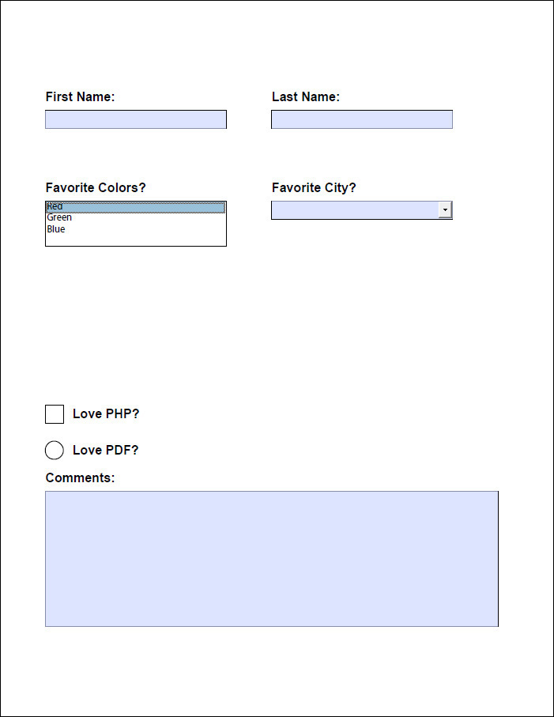

pop-pdf
=======

[](https://travis-ci.org/popphp/pop-pdf)
[](http://cc.popphp.org/pop-pdf/)

OVERVIEW
--------
Pop PDF is a powerful and robust PDF processing component that's simple to use. With it,
you can create PDF documents from scratch, or import existing ones and add to or modify
them. It supports embedding images, fonts and URLs, as well as a set of drawing, effect
and type features.

`pop-pdf` is a component of the [Pop PHP Framework](http://www.popphp.org/).

INSTALL
-------

Install `pop-pdf` using Composer.

    composer require popphp/pop-pdf

##### A Note About Document Origin
The PDF coordinate system starts with x, y origin (0, 0) at the bottom left. This can be changed by the
user if the user prefers to set the origin to a different point for the purpose of the application.
See the [Set Origin](#set-origin) section for more details on that.

## BASIC USAGE

* [Create and add pages](#create-and-add-pages)
* [Add a standard font](#add-a-standard-font-and-add-some-text)
* [Embed a font](#embed-a-font-and-add-some-text)
* [Embed an image](#embed-an-image)
* [Draw a Shape](#draw-a-shape)
* [Add a URL link](#add-a-url-link)
* [Import another PDF](#import-from-another-pdf-document)
* [Forms](#forms)
* [Set Origin](#set-origin)

### Create and add pages

You can add a page based on pre-defined sizes or create one of a custom size. The predefined sizes are:

| Page        | (W x H)       | Page        | (W x H)       | Page        | (W x H)       |
|-------------|---------------|-------------|---------------|-------------|---------------|
| ENVELOPE_10 | (297  x 684)  | A1          | (1684 x 2384) | B1          | (2064 x 2920) |
| ENVELOPE_C5 | (461  x 648)  | A2          | (1191 x 1684) | B2          | (1460 x 2064) |
| ENVELOPE_DL | (312  x 624)  | A3          | (842  x 1191) | B3          | (1032 x 1460) |
| FOLIO       | (595  x 935)  | A4          | (595  x 842)  | B4          | (729  x 1032) |
| EXECUTIVE   | (522  x 756)  | A5          | (420  x 595)  | B5          | (516  x 729)  |
| LETTER      | (612  x 792)  | A6          | (297  x 420)  | B6          | (363  x 516)  |
| LEGAL       | (612  x 1008) | A7          | (210  x 297)  | B7          | (258  x 363)  |
| LEDGER      | (1224 x 792)  | A8          | (148  x 210)  | B8          | (181  x 258)  |
| TABLOID     | (792  x 1224) | A9          | (105  x 148)  | B9          | (127  x 181)  |
| A0          | (2384 x 3370) | B0          | (2920 x 4127) | B10         | (91   x 127)  |

```php
use Pop\Pdf\Pdf;
use Pop\Pdf\Document;
use Pop\Pdf\Document\Page;

$doc = new Document();

$letter = new Page(Page::LETTER);
$custom = new Page(1000, 500);

// Do some things to the pages, add text, images, etc.

$doc->addPage($letter);
$doc->addPage($custom);

Pdf::outputToHttp($doc);
```

Alternatively, you can use the document object as a page factory, which will automatically
add the page to the document object:

```php
use Pop\Pdf\Pdf;
use Pop\Pdf\Document;
use Pop\Pdf\Document\Page;

$doc = new Document();

$legal = $doc->createPage(Page::LEGAL);

// Do some things to the pages, add text, images, etc.

Pdf::outputToHttp($doc);
```

### Add a standard font and add some text

The standard fonts that are available by default with a PDF document are:

|                 | Standard PDF Fonts  |                        |
|-----------------|---------------------|------------------------|
|Arial            |CourierNew,Bold      |Times-Bold              |
|Arial,Italic     |Courier-BoldOblique  |Times-Italic            |
|Arial,Bold       |CourierNew,BoldItalic|Times-BoldItalic        |
|Arial,BoldItalic |Helvetica            |TimesNewRoman           |
|Courier          |Helvetica-Oblique    |TimesNewRoman,Italic    |
|CourierNew       |Helvetica-Bold       |TimesNewRoman,Bold      |
|Courier-Oblique  |Helvetica-BoldOblique|TimesNewRoman,BoldItalic|
|CourierNew,Italic|Symbol               |ZapfDingbats            |
|Courier-Bold     |Times-Roman          |                        |

```php
use Pop\Pdf\Pdf;
use Pop\Pdf\Document;
use Pop\Pdf\Document\Font;
use Pop\Pdf\Document\Page;

$doc = new Document();
$doc->addFont(new Font('Arial'));

$page = new Page(Page::LETTER);
$page->addText(new Page\Text('Hello World', 36), 'Arial', 50, 600);

$doc->addPage($page);

Pdf::outputToHttp($doc);
```

[Top](#basic-usage)

### Embed a font and add some text

You can embed an external font into a PDF documents. The font types that are supported are:

* TrueType (ttf)
* OpenType (otf)
* Type1 (pfb)

Most fonts of these types should work, but there are situations were the font may not be parsable,
such as when a font's embeddable flag is set to false.

```php
use Pop\Pdf\Pdf;
use Pop\Pdf\Document;
use Pop\Pdf\Document\Font;
use Pop\Pdf\Document\Page;

$font = new Font('/path/to/some/font.ttf');

$doc = new Document();
$doc->embedFont($font);

$page = new Page(Page::LETTER);
$page->addText(new Page\Text('Hello World', 36), $font->getName(), 50, 600);

$doc->addPage($page);

Pdf::outputToHttp($doc);
```

[Top](#basic-usage)

### Embed an image

```php
use Pop\Pdf\Pdf;
use Pop\Pdf\Document;
use Pop\Pdf\Document\Page;
use Pop\Pdf\Document\Page\Image;

$doc = new Document();

$page = new Page(Page::LETTER);
$page->addImage(Image::createImageFromFile('/path/to/some/image.jpg'), 100, 600);

$doc->addPage($page);

Pdf::outputToHttp($doc);
```

[Top](#basic-usage)

### Draw a shape

```php
use Pop\Pdf\Pdf;
use Pop\Pdf\Document;
use Pop\Pdf\Document\Page;
use Pop\Pdf\Document\Page\Path;
use Pop\Pdf\Document\Page\Color;

$doc = new Document();

$path = new Path(Path::FILL_STROKE);
$path->setFillColor(new Color\Rgb(155, 20, 20))
     ->setStrokeColor(new Color\Rgb(81, 125, 153))
     ->setStroke(5)
     ->drawRectangle(50, 400, 320, 240);

$page = new Page(Page::LETTER);
$page->addPath($path);

$doc->addPage($page);

Pdf::outputToHttp($doc);
```

[Top](#basic-usage)

### Add a URL link

```php
use Pop\Pdf\Pdf;
use Pop\Pdf\Document;
use Pop\Pdf\Document\Page;
use Pop\Pdf\Document\Page\Annotation;

$doc = new Document();

$url = new Annotation\Url(120, 20, 'http://www.google.com/');

$page = new Page(Page::LETTER);
$page->addUrl($url, 50, 500);

$doc->addPage($page);

Pdf::outputToHttp($doc);
```

[Top](#basic-usage)

### Import from another PDF document

```php
use Pop\Pdf\Pdf;
use Pop\Pdf\Document;
use Pop\Pdf\Document\Page;
use Pop\Pdf\Document\Page\Image;

// Import pages 2, 4 and 6 from a six page document
$doc = Pdf::importFromFile('/path/to/six-page-document.pdf', [2, 4, 6]);

// Add an image to page 3 (formerly page 6)
$doc->getPage(3)->addImage(Image::createImageFromFile('/path/to/some/image.jpg'), 100, 600);

$pdf->outputToHttp($doc);
```

[Top](#basic-usage)

### Forms

Forms and form fields are supported in Pop PDF, however, please note that not all browsers
consistently support forms and form fields in their default PDF readers. It is recommended
that if you generate a PDF with a form in it using Pop PDF, that your end user views it
in an Adobe product.

The types of fields that are currently supported in Pop PDF are:

- Single-line text fields
- Multi-line text fields
- Single-select choice fields (e.g., an HTML select drop-down)
- Multi-select choice fields (e.g., an HTML multi-select drop-down)
- Push buttons (by default, display and act like a checkbox)
- Radio buttons

*NOTE: A group of radio buttons is not supported at this time.*

The following script below demonstrates how to add the various fields to a form in a
PDF object. While lengthy, it includes text and graphic support for field names and
borders:

```php
use Pop\Pdf\Pdf;
use Pop\Pdf\Document;
use Pop\Pdf\Document\Font;
use Pop\Pdf\Document\Form;
use Pop\Pdf\Document\Page;
use Pop\Pdf\Document\Page\Path;
use Pop\Pdf\Document\Page\Text;

$form = new Form('contact_form');

$document = new Document();
$document->addForm($form);
$document->addFont(new Font(Font::ARIAL));
$document->addFont(new Font(Font::ARIAL_BOLD));

$firstName = new Page\Field\Text('first_name');
$firstName->setWidth(200)
    ->setHeight(20);

$lastName = new Page\Field\Text('last_name');
$lastName->setWidth(200)
    ->setHeight(20);

$colors = new Page\Field\Choice('colors');
$colors->addOption('Red')
    ->addOption('Green')
    ->addOption('Blue')
    ->setMultiSelect()
    ->setWidth(200)
    ->setHeight(50)
    ->setFont(Font::ARIAL)
    ->setSize(11);

$city = new Page\Field\Choice('city');
$city->addOption('New Orleans')
    ->addOption('New York')
    ->addOption('Los Angeles')
    ->setCombo()
    ->setWidth(200)
    ->setHeight(20)
    ->setFont(Font::ARIAL)
    ->setSize(11);

$lovePhp = new Page\Field\Button('love_php');
$lovePhp->addOption('PHP')->setWidth(20)
    ->setHeight(20);

$lovePdf = new Page\Field\Button('love_pdf');
$lovePdf->addOption('PDF')->setRadio()
    ->setWidth(20)
    ->setHeight(20);

$comments = new Page\Field\Text('comments');
$comments->setWidth(500)
    ->setHeight(150)
    ->setMultiline();

$page = new Page(Page::LETTER);

$page->addText(new Text('First Name:', 14), Font::ARIAL_BOLD, 50, 680);
$page->addText(new Text('Last Name:', 14), Font::ARIAL_BOLD, 300, 680);
$page->addText(new Text('Favorite Colors?', 14), Font::ARIAL_BOLD, 50, 580);
$page->addText(new Text('Favorite City?', 14), Font::ARIAL_BOLD, 300, 580);
$page->addText(new Text('Love PHP?', 14), Font::ARIAL_BOLD, 80, 330);
$page->addText(new Text('Love PDF?', 14), Font::ARIAL_BOLD, 80, 290);
$page->addText(new Text('Comments:', 14), Font::ARIAL_BOLD, 50, 260);
$page->addPath((new Path())->drawRectangle(50, 650, 200, 20));
$page->addPath((new Path())->drawRectangle(300, 650, 200, 20));
$page->addPath((new Path())->drawRectangle(50, 520, 200, 50));
$page->addPath((new Path())->drawRectangle(300, 550, 200, 20));
$page->addPath((new Path())->drawSquare(50, 325, 20));
$page->addPath((new Path())->drawCircle(60, 295, 10));
$page->addPath((new Path())->drawRectangle(50, 100, 500, 150));

$page->addField($firstName, 'contact_form', 50, 650)
    ->addField($lastName, 'contact_form', 300, 650)
    ->addField($colors, 'contact_form', 50, 520)
    ->addField($city, 'contact_form', 300, 550)
    ->addField($lovePhp, 'contact_form', 50, 325)
    ->addField($lovePdf, 'contact_form', 50, 285)
    ->addField($comments, 'contact_form', 50, 100);

$document->addPage($page);

Pdf::outputToHttp($document);
```

The above code produces a PDF with a form like this:



[Top](#basic-usage)

### Set Origin

Options for setting the origin of the document are:

* ORIGIN_TOP_LEFT
* ORIGIN_TOP_RIGHT
* ORIGIN_BOTTOM_LEFT
* ORIGIN_BOTTOM_RIGHT
* ORIGIN_CENTER

```php
use Pop\Pdf\Document;

$doc = new Document();
$doc->setOrigin(Document::ORIGIN_TOP_LEFT);
```

[Top](#basic-usage)
